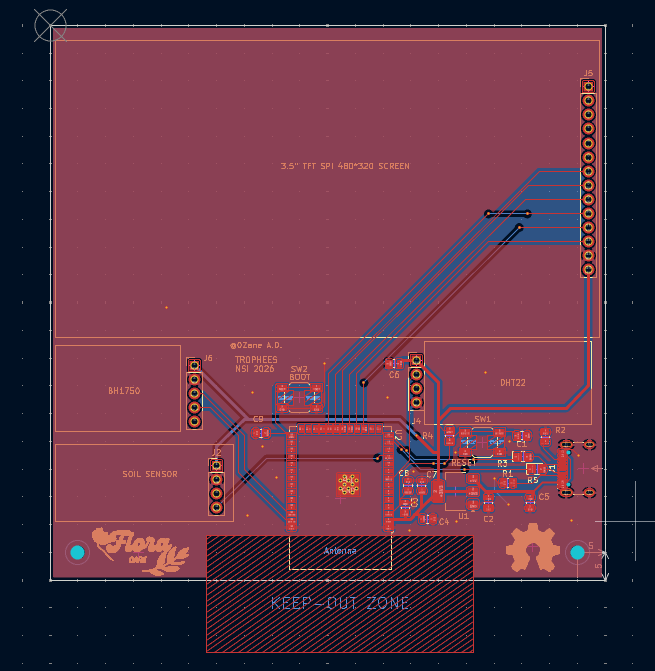

# PCB FloraCare

## 📋 Description

Ceci est le circuit imprimé (PCB) du projet FloraCare, conçu pour contrôler et monitorer les conditions de croissance des plantes.

## 🛠 Conception

- **Outil de conception** : KiCad
- **Fichiers de conception** :
  - `floracare.kicad_sch` - Schéma électrique
  - `floracare.kicad_pcb` - Layout du PCB
  - `floracare.kicad_pro` - Fichier projet KiCad


## 📐 Visualisation du circuit imprimé

Consultez la visualisation du PCB :



## 📄 Schéma éléctrique

Pour la documentation détaillée du PCB, consultez : [floracare.pdf](floracare.pdf)

## 🏭 Fabrication

Le PCB a été commandé auprès de **JLCPCB** pour la fabrication.
L'assemblage est fait à la main par @0Zane

- **Fabricant** : JLCPCB
- **Format d'export** : Gerber + fichiers de perçage

## 📦 Contenu du Dossier

```
hardware/
├── floracare.kicad_sch       # Schéma électrique
├── floracare.kicad_pcb       # Design du PCB
├── floracare.kicad_pro       # Fichier projet
├── pcb.png                   # Visualisation du PCB
├── floracare.pdf             # Documentation complète
└── README.md                 # Ce fichier
```

## 🔧 Outils Requis

Pour modifier ou afficher ce projet PCB, vous aurez besoin de :
- **KiCad** 9.0 ([kicad.org](https://www.kicad.org))

---

Pour toute question sur le PCB ou sa fabrication, ouvrez une question dans la section discussions du repo github.
