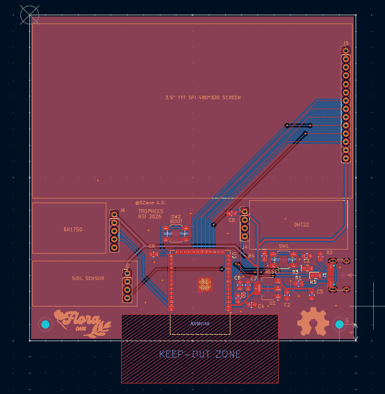

# PCB FloraCare

## 📋 Description

This is the printed circuit board (PCB) for the FloraCare project, designed to control and monitor plant growing conditions.


## 🛠 Design

* **Design Tool**: KiCad
* **Design Files**:

  * `floracare.kicad_sch` - Electrical schematic
  * `floracare.kicad_pcb` - PCB layout
  * `floracare.kicad_pro` - KiCad project file

## 📐 PCB Preview

View the PCB rendering:



## 📄 Electrical Schematic

For detailed PCB documentation, see: [floracare.pdf](floracare.pdf)

## 🏭 Manufacturing

The PCB was ordered from **JLCPCB** for fabrication.
Assembly is done by hand by @0Zane.

* **Manufacturer**: JLCPCB
* **Export Format**: Gerber files + drill files

## 📦 Directory Structure

```text
hardware/
├── floracare.kicad_sch       # Electrical schematic
├── floracare.kicad_pcb       # PCB design
├── floracare.kicad_pro       # Project file
├── pcb.png                   # PCB preview
├── floracare.pdf             # Complete documentation
└── README.md                 # This file
```

## 🔧 Required Tools

To view or modify this PCB project, you will need:

* **KiCad** 9.0 (https://www.kicad.org)

---

For any questions regarding the PCB or its manufacturing process, please open a discussion in the GitHub repository's Discussions section.
